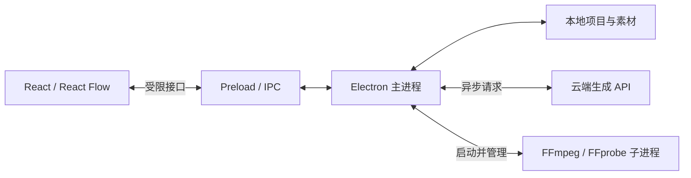

# 技术架构

## 已确定的技术基础

React + TypeScript 构建界面，React Flow 提供画布交互，Electron 提供桌面能力。AI 生成走云端 API，本地媒体处理使用 FFmpeg，媒体元信息由 FFprobe 读取。

通用 UI 使用 shadcn/ui 的 Base UI 组件，样式使用 Tailwind CSS。视频卡片、组合和吸附反馈由业务组件实现，具体分工见 [UI 基础与组件约定](ui-foundation.md)。

本地业务逻辑直接放在 Electron 中，无需另起 HTTP 后端。Vite 开发服务器只用于开发期加载页面和热更新，生产运行不依赖它。

## 进程与模块边界

| 位置 | 负责 | 当前状态 |
| --- | --- | --- |
| `src/renderer` | 页面、画布、选择、编辑参数、播放 UI | 空画布已建立 |
| `src/preload` | 对界面暴露具体、类型化的桌面能力 | 仅有读取应用信息 |
| `src/main` | 窗口、文件、任务调度、持久化、云端适配 | 窗口和应用信息 IPC 已建立 |
| `src/shared` | 跨进程接口与共享类型 | 基础桌面接口已建立 |
| 媒体子进程 | 探测视频、生成缩略图、转码、裁剪、合并 | 尚未接入 |

当前 preload 使用 CommonJS 输出以兼容 Electron 沙箱预加载；源码与主进程继续使用 ESM。渲染进程启用隔离和沙箱，关闭 Node 集成。原始 IPC、任意 shell 执行、任意文件读写不暴露给页面。

每个新增 IPC 接口都需要在主进程验证来源和参数。当前应用仅允许自身主窗口主 frame 调用应用信息接口，并拒绝额外窗口、页面跳转和浏览器权限请求。

## 建议的数据概念（尚未冻结为实现契约）

| 概念 | 含义 |
| --- | --- |
| Project | 一个本地项目，保存画布视口与素材关系 |
| Asset | 实际文件及元信息，含本地导入与云端结果 |
| Shot | 一个镜头的分镜文本、参考图、生成记录与候选版本 |
| Clip | 某个视频版本在画布中的使用实例，含截取和裁切参数 |
| Composition | 按顺序排列的 Clip 列表，对应组合卡片 |
| CanvasItem | 单视频或组合在画布上的位置与展示状态 |

同一个镜头可以有多个生成版本；相同素材可以被多次使用。不要把磁盘文件、镜头、裁剪后的片段和 React Flow 节点混成同一个 ID。

视频文件放在磁盘上；数据库保存引用和参数，不将完整二进制或 Base64 视频塞入 React 状态、项目数据库或 IPC 返回值。

首版组合建议使用扁平的片段列表。组合 A 和组合 B 拼接时合并两份有序列表，避免不断形成嵌套组合。自由移动整张组合不会改变列表顺序。

本地数据库已确定使用 SQLite。设置中统一配置项目保存根目录，新建、创建副本和导入项目包均自动在该目录下创建独立项目文件夹，不逐个选择保存位置。建议每个项目独立使用一个项目数据库，素材放在同目录；应用数据库保存设置、项目位置索引，以及迁移和任务恢复所需的运行记录，项目内容仍以项目数据库为准。具体规则见 [本地项目管理](project-management.md)。当前尚未安装数据库驱动、建立数据表或实现保存，不需要连接测试 PostgreSQL。

数据库连接和项目目录由 Electron 后台统一管理，通过类型化项目操作暴露给界面。页面不传任意 SQL。需要大量读写时使用专门的后台 worker，避免阻塞主窗口；SQLite 驱动及迁移工具在持久化实现阶段验证选定。

更换项目保存根目录是整个项目库的迁移操作。后台先保存并暂停项目写入，将项目数据库和素材复制、校验完成后，再一次性更新应用数据库中的根目录、项目索引、存储版本和迁移阶段。切换前失败或取消保持原目录有效，切换后在新目录继续运行；应用数据库本身仍留在 `userData`。

生成模块只负责云端任务，结果接收模块将文件下载到固定的独立磁盘暂存区，项目保存模块负责排队、提交素材和迁移协调。任务用项目 ID 和任务 ID 关联，不携带最终绝对路径。保存队列在应用数据库持久化，文件在 `userData/staging/` 持久保存，二者均不随项目目录迁移。

项目保存模块在同一受控流程中检查迁移状态、获取当前目录和存储版本、打开文件并登记素材。迁移期间只阻止写入项目，云端生成和向暂存区下载可以继续；已缓存的结果排队等待。迁移先等待正在提交的保存操作结束，再复制项目。切换成功后解除保存阻塞，队列重新解析新位置并提交；切换前取消或失败则恢复原位置。具体职责与恢复规则见 [生成与保存](generation-saving.md)。

源数据清理由持久化迁移清单限定范围，默认在切换成功后自动执行。文件受管归属来自数据库／素材／缓存／临时文件登记，不能仅凭文件名、后缀或位于项目目录内判断。只删除有复制校验凭据、源文件仍符合清单的项目文件，以及明确登记为可重建的缓存或可丢弃临时文件；未知文件、符号链接及变化过的文件保留。目录只做受管空目录删除，不递归清空用户选择的根目录。清理逐项记账，失败显示待清理状态并支持重试，不回滚已生效的新目录。

## 本地媒体处理

初期开发环境可以使用本机安装的 FFmpeg 和 FFprobe。`pnpm doctor:media` 只检查二进制是否可运行，不代表裁剪、导出链路已验证。

后续由主进程通过 `spawn(executable, args, { shell: false })` 调用原生工具，避免拼接 shell 命令。媒体任务需要有进度、取消、有限并发和失败信息；不要在主进程同步转码。

画布上的组合操作应立即更新项目数据。真正的视频文件合并可以在导出或构建预览缓存时执行，避免每拖动一次就等待重新编码。

预览时使用裁剪参数与有序片段列表，必要时生成代理视频。不能假定 Electron 能解码所有用户导入的视频。精确切点、不同编码／尺寸／帧率的视频合并和音画衔接必须用真实素材验证。

正式分发时需要确定各操作系统和芯片架构对应的 FFmpeg 构建、编码器能力、资源路径与相关许可材料。此项尚未完成，当前没有把开发机的二进制文件打包进仓库。

## 云端生成

未来在 Electron 后台建立 provider adapter，处理提交任务、查询状态、获取结果地址和错误映射。不同服务商的模型参数和素材上传约束由适配层吸收，页面使用明确的能力描述。通用结果接收模块负责下载到暂存区，项目保存队列负责最终落盘，服务商适配层不感知项目目录迁移。

不把服务商密钥编译进渲染页面，不在日志和仓库中记录凭证。账号和计费作为后续独立范围处理，本次不预建相关模块。

生成任务在目录迁移期间可以继续由云端执行，下载也可继续写入独立暂存区。迁移前发出的请求、进行中的结果下载和迁移后的保存重试均遵循 [生成与保存](generation-saving.md) 的持久化及去重规则，不重新发起付费生成。关闭应用后的恢复、远端结果过期和下载失败仍需在服务商接入阶段验证；当前不承诺应用退出后后台持续执行。

## 资料

- [Electron 进程模型](https://www.electronjs.org/docs/latest/tutorial/process-model)
- [Electron IPC](https://www.electronjs.org/docs/latest/tutorial/ipc)
- [Electron 安全建议](https://www.electronjs.org/docs/latest/tutorial/security)
- [electron-vite](https://electron-vite.org/guide/)
- [React Flow 自定义节点](https://reactflow.dev/learn/customization/custom-nodes)
- [FFmpeg](https://ffmpeg.org/ffmpeg.html) 与 [FFprobe](https://ffmpeg.org/ffprobe.html)
