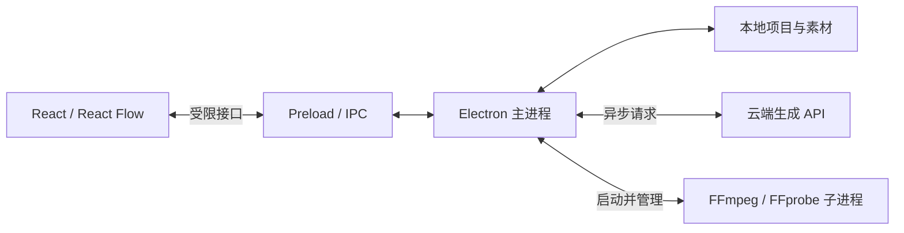

# 技术架构

## 已确定的技术基础

React + TypeScript 构建界面，React Flow 提供画布交互，Electron 提供桌面能力。AI 生成走云端 API，本地媒体处理使用 FFmpeg，媒体元信息由 FFprobe 读取。

本地业务逻辑直接放在 Electron 中，无需另起 HTTP 后端。Vite 开发服务器只用于开发期加载页面和热更新，生产运行不依赖它。

## 进程与模块边界

| 位置 | 负责 | 当前状态 |
| --- | --- | --- |
| `src/renderer` | 页面、画布、选择、编辑参数、播放 UI | 空画布已建立 |
| `src/preload` | 对界面暴露具体、类型化的桌面能力 | 仅有读取应用信息 |
| `src/main` | 窗口、文件、任务调度、持久化、云端适配 | 窗口和应用信息 IPC 已建立 |
| `src/shared` | 跨进程接口与共享类型 | 基础桌面接口已建立 |
| 媒体子进程 | 探测视频、生成缩略图、转码、裁剪、合并 | 尚未接入 |

当前 preload 使用 CommonJS 输出以兼容 Electron 沙箱预加载；源码与主进程继续使用 ESM。渲染进程启用隔离和沙箱，关闭 Node 集成。原始 IPC、任意 shell 执行、任意文件读写不暴露给页面。

每个新增 IPC 接口都需要在主进程验证来源和参数。当前应用仅允许自身主窗口主 frame 调用应用信息接口，并拒绝额外窗口、页面跳转和浏览器权限请求。

## 建议的数据概念（尚未冻结为实现契约）

| 概念 | 含义 |
| --- | --- |
| Project | 一个本地项目，保存画布视口与素材关系 |
| Asset | 实际文件及元信息，含本地导入与云端结果 |
| Shot | 一个镜头的分镜文本、参考图、生成记录与候选版本 |
| Clip | 某个视频版本在画布中的使用实例，含截取和裁切参数 |
| Composition | 按顺序排列的 Clip 列表，对应组合卡片 |
| CanvasItem | 单视频或组合在画布上的位置与展示状态 |

同一个镜头可以有多个生成版本；相同素材可以被多次使用。不要把磁盘文件、镜头、裁剪后的片段和 React Flow 节点混成同一个 ID。

视频文件放在磁盘上；画布状态保存引用和参数，不将完整二进制或 Base64 视频塞入 React 状态、项目 JSON 或 IPC 返回值。

首版组合建议使用扁平的片段列表。组合 A 和组合 B 拼接时合并两份有序列表，避免不断形成嵌套组合。自由移动整张组合不会改变列表顺序。

项目持久化格式尚未确定。JSON 项目文件和 SQLite 均可评估，初始化阶段不提前引入数据库，也不需要连接测试 PostgreSQL。

## 本地媒体处理

初期开发环境可以使用本机安装的 FFmpeg 和 FFprobe。`pnpm doctor:media` 只检查二进制是否可运行，不代表裁剪、导出链路已验证。

后续由主进程通过 `spawn(executable, args, { shell: false })` 调用原生工具，避免拼接 shell 命令。媒体任务需要有进度、取消、有限并发和失败信息；不要在主进程同步转码。

画布上的组合操作应立即更新项目数据。真正的视频文件合并可以在导出或构建预览缓存时执行，避免每拖动一次就等待重新编码。

预览时使用裁剪参数与有序片段列表，必要时生成代理视频。不能假定 Electron 能解码所有用户导入的视频。精确切点、不同编码／尺寸／帧率的视频合并和音画衔接必须用真实素材验证。

正式分发时需要确定各操作系统和芯片架构对应的 FFmpeg 构建、编码器能力、资源路径与相关许可材料。此项尚未完成，当前没有把开发机的二进制文件打包进仓库。

## 云端生成

未来在主进程建立 provider adapter，处理提交任务、查询状态、下载结果和错误映射。不同服务商的模型参数和素材上传约束由适配层吸收，页面使用明确的能力描述。

不把服务商密钥编译进渲染页面，不在日志和仓库中记录凭证。账号和计费作为后续独立范围处理，本次不预建相关模块。

关闭应用后的生成任务恢复、重复提交保护、远端结果过期和下载失败，需要在云端接入阶段设计；当前不承诺后台持续执行。

## 资料

- [Electron 进程模型](https://www.electronjs.org/docs/latest/tutorial/process-model)
- [Electron IPC](https://www.electronjs.org/docs/latest/tutorial/ipc)
- [Electron 安全建议](https://www.electronjs.org/docs/latest/tutorial/security)
- [electron-vite](https://electron-vite.org/guide/)
- [React Flow 自定义节点](https://reactflow.dev/learn/customization/custom-nodes)
- [FFmpeg](https://ffmpeg.org/ffmpeg.html) 与 [FFprobe](https://ffmpeg.org/ffprobe.html)
