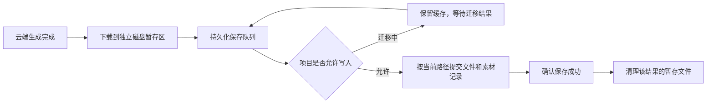

# 生成与保存

更新时间：2026-09-28。本文为设计方案，相关模块尚未实现。

## 分工与流程

已确定：生成与保存分开；保存时如果项目正在迁移，先缓存结果文件，迁移完成后再保存。

建议所有生成结果都走同一条流程，无迁移时缓存完成后立即保存，有迁移时在保存队列等待。生成模块只处理云端任务，不读取项目目录或迁移状态。

| 模块 | 负责 | 不需要知道 |
| --- | --- | --- |
| 生成模块 | 提交云端任务、查询状态、获取结果信息 | 本地项目位置和迁移细节 |
| 结果接收模块 | 将结果下载、校验并暂存，创建待保存任务 | 最终项目位置 |
| 项目保存模块 | 持久化队列、写入项目、迁移协调、保存重试 | 模型生成过程 |

一期按这些职责划分后台模块，不为保存队列额外启动 HTTP 服务或消息中间件。

## 独立磁盘暂存

暂存区建议使用固定的 `userData/staging/<task-id>/<result-id>/`，位于项目根目录之外。它不随项目搬移，也不属于项目中可以重建的 `cache/`。更改项目根目录时拒绝与应用数据库或暂存区重叠的路径。

下载先写已登记的部分文件，完整下载并校验后标记为可提交；部分文件不能作为完整结果入队。应用数据库持久化项目 ID、任务 ID、结果 ID、暂存文件位置、校验值和提交状态，不将视频二进制放进 SQLite。

缓存的是实际文件，不只是远端下载链接。软件重启后先核对文件与队列记录，恢复未完成下载和待保存项；中途崩溃留下的文件与状态不一致需要重试或修复，不能直接显示已保存。

未交付结果不按普通缓存容量或时间自动淘汰。缓存磁盘和项目目标磁盘分别检查空间，限制下载并发和暂存总量；空间不足时保留已有文件并显示下载／保存暂停，不能静默丢弃结果或重新提交付费生成。持续迁移时也不能无限累积缓存。

下载失败或链接过期时按服务商能力获取原任务的新结果地址；已完整缓存则直接复用。恢复能力需在真实服务商接入时验证，不能承诺应用关闭后还继续下载。

## 保存与迁移协调

保存操作关联项目 ID 和结果 ID，最终目录只在实际提交时解析。保存模块统一管理项目写入许可和迁移锁：检查状态、获取当前路径及版本、开始提交是一个不可被迁移插入的决策过程。不能用一个独立的 `if (isMigrating)` 检查后直接写文件。

- **无迁移：** 取得项目写入许可，解析当前位置，提交缓存结果。
- **正在迁移：** 保存任务持久化为等待状态，保留缓存，等待状态变化通知，不循环重试写旧目录。云端生成和向暂存区下载仍可继续。
- **保存已经开始：** 迁移阻止新的项目提交，等待已取得许可的操作结束或完成失败收尾，再冻结项目快照；不等待全部云端任务或暂存区下载完成。
- **迁移成功：** 新目录经校验和切换后，解除保存阻塞，按新路径处理等待项。旧数据清理失败不会无限阻塞保存；具体先后顺序遵循 [项目管理](project-management.md) 的迁移流程。
- **迁移切换前取消／失败：** 解除阻塞，队列重新解析仍然有效的原位置并保存。
- **重启或再次迁移：** 先恢复项目位置和迁移阶段，再发放写入许可；不复用上次的绝对路径或旧存储版本。

生成结果与下载进度在应用数据库记录，迁移关闭项目数据库期间也不丢事件。生成失败、下载失败和项目保存失败分别处理；保存失败只重试保存，不重新发起生成。

## 提交成功后再清理缓存

目标与暂存区可能跨磁盘，不能直接假定一次重命名即可交付。保存模块复制到目标受管临时文件，校验并在目标卷内完成文件就位，再用 SQLite 事务登记素材与任务结果。完成后确认保存队列，最后清理独立暂存副本。

文件系统写入和 SQLite 事务无法作为一个整体自动提交，重试必须检查两者。项目内对任务 ID 与结果 ID 建立唯一关联：目标文件已存在时校验复用，素材已登记时确认已有提交，不重复创建卡片或素材。项目已提交、队列未确认就崩溃时，重启核对后补确认；只写好文件但数据库失败时保留暂存数据并补交记录。

只有确认目标文件和素材记录均已提交，才允许清理对应暂存文件。清理失败只留下可重试的已交付副本；项目保存失败则保留未交付缓存。迁移对旧目录的清理不触及暂存区，不会删掉正在等待保存的结果。

## 界面与验收

状态使用「生成中」「下载中」「已缓存，等待迁移」「保存中」「已保存」「保存失败，可重试」等明确文案。缓存完成代表结果已暂存，尚不代表已进入项目；项目包导出也不能把暂存区中尚未提交的结果当作项目内素材。

- [ ] 迁移期间仍能下载完整结果到独立暂存区，项目目录中没有新增结果写入。
- [ ] 已缓存结果在迁移成功后进入新目录，切换前取消后进入原目录，无需重新生成。
- [ ] 保存检查与迁移启动同时发生时，写入仍由正确许可保护，不写入失效路径。
- [ ] 下载中、缓存完成后、目标文件就位后、SQLite 提交后及清理前分别崩溃，重启均可识别实际进度并恢复。
- [ ] 重复回调和保存重试不会重复登记结果或触发新的付费生成。
- [ ] 缓存满、目标盘不可用和清理失败不会误报已保存或删除未交付结果。
- [ ] 项目迁移清理、普通缓存清理与独立暂存区清理的范围不混用。
