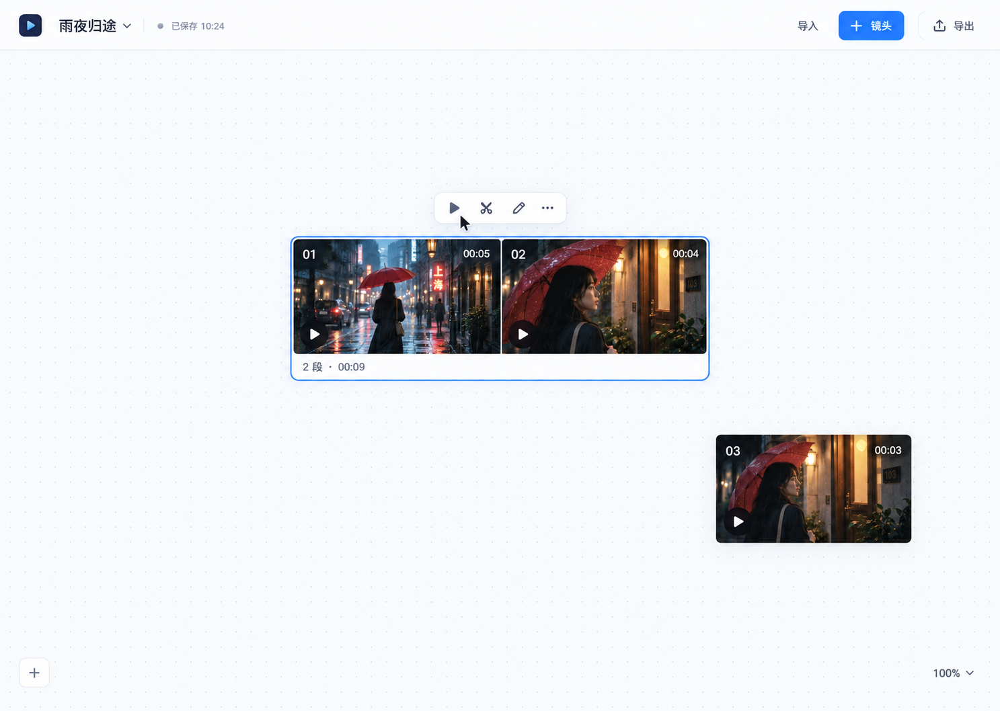

# 一期产品范围与页面

更新时间：2026-10-04。

本文件记录产品方向。交互细节见 [交互规范](interactions.md)，工程完成度见 [实施顺序](roadmap.md)。「已确定」来自当前讨论；「建议」与「待确定」不得当作已获确认的最终设计。

## 已确定的方向

用户在本地桌面软件中创作视频。既支持导入本地媒体，也支持通过云端 API 生成图片和视频。暂不支持本机 ComfyUI。

主画布聚焦视频：组织、拼接、预览、播放、截取时段和裁切画面。参考图、图片生成、分镜文本和模型参数收在对应镜头内部，避免不同类型的节点混在主画布上。

两个视频卡片左右贴合后成为一个组合，按从左到右的顺序播放。组合只有一个播放入口；单个片段的选中与编辑不额外增加播放按钮。

界面以简洁、低负担为优先：卡片紧凑，常驻按钮少，操作随选择出现。完整播放控制可在放大预览后呈现。

在设置中统一指定项目保存目录，新建项目只填名称，不逐个选择保存位置。修改保存目录时需要迁移已有项目，成功后统一使用新位置。项目独立保存，本地数据库使用 SQLite。项目目录、素材收纳和自动保存规则见 [本地项目管理](project-management.md)。项目与存储第一版已实现，项目包导入导出仍待实现。

迁移时已有生成任务的后续结果必须保存到新目录。迁移成功后自动删除原位置中已验证的项目重复数据，保留同级目录及项目目录内由用户另放的文件；不能整目录递归删除。

生成与保存分开：保存阶段遇到项目迁移时，结果文件先保留在独立的磁盘暂存区，切换完成后自动保存到新目录。建议所有生成结果统一走「下载到暂存区 → 保存队列」流程；界面明确区分生成、下载、等待迁移和已保存。具体见 [生成与保存](generation-saving.md)。

## 当前一期目标

先确定项目首页、主画布、放大播放、镜头编辑和裁剪的页面关系，并用交互原型验证：

1. 用户能直接看懂什么可以拖动、如何把两个视频拼起来。
2. 拼接后能识别顺序、选中某一段、统一播放，并返回原画布位置。
3. 用户知道在哪里修改生成素材，在哪里编辑已经得到的视频。
4. 不因频繁打开窗口、重复按钮和同时播放多个视频而失去操作焦点。

当前已有项目首页、真实视频导入和主画布交互第一版。交互验证使用明确标注的本地示例视频，不把模拟生成或模拟导出展示成真实功能。

## 页面与视图

| 视图 | 职责 | 出现时机 | 状态 |
| --- | --- | --- | --- |
| 项目首页 | 新建、打开、最近项目；项目包导入放在次级入口 | 启动软件或返回项目列表 | 项目管理已实现；项目包待实现 |
| 主画布 | 单视频卡片、组合卡片、选择、拖动、吸附拼接、缩放 | 进入项目后 | 第一版已实现 |
| 播放与编辑页 | 占满应用窗口播放单视频／组合；统一轨道、选择片段、拖动入出点 | 点击唯一播放入口或双击卡片 | 已实现；音频无缝衔接未验证 |
| 镜头素材子画布 | 文本、图片、视频、音频卡片及生成组 | 主画布「新建镜头」或视频卡片「编辑镜头素材」 | 本地素材与每镜头保存已实现 |
| 生成组合悬浮编辑 | 弧形素材轮盘、多文本块、Seedance／Seedream 参数 | 点击组标题或右键菜单「展开编辑」 | 本地草稿已实现；云端提交待接入 |
| 简单时间裁剪 | 选中片段拖动两端，调整入点和出点 | 播放与编辑页下方轨道 | 已实现；画面裁切与中间切开后续规划 |

最新确认：播放和简单时间裁剪共用全窗口页面；生成素材放在镜头内部的子画布。框选成组或合并已有组后留在画布并选中新组，点击「展开编辑」才从原位置展开悬浮编辑，画布保留为背景；左侧滚动素材轮盘，中间多个独立文本块拼成大卡片，右侧设置 Seedance 参数。文本块标题长按后可拖动排序，拖出中间卡片后松手移回画布；没有文本时补空文本块。多个生成组独立保存素材与参数。主画布仅展示视频与待生成镜头，收起时保留位置和选择。图片生成的组合和参数草稿现已加入同一个子画布；选中文本可建文生图组，选中图片／文本可建图生图组，模式按有无参考图自动切换。云端图片生成任务与候选历史留待云端接入阶段。详见 [镜头素材子画布](video-generation.md)。

## 视觉参考

最近一版概念图仅作为「浅色、紧凑卡片、横向拼接、按需显示工具」的方向参考。

**图中的多重播放入口已被否定。实际设计以组合只有一个播放入口为准。** 卡片尺寸、顶栏按钮、裁剪视图和编辑页尚未定稿。图里的媒体是生成的示意素材，不代表已有视频功能。

## 本期范围之外

- 登录、用户管理、额度、充值和计费。
- 本机模型运行和 ComfyUI。
- 多人协作、云端项目同步。
- 专业多轨时间轴、复杂转场、字幕和音频混音工作台。
- 正式安装包签名、自动更新及发布渠道。

## 待确定事项

- 正式支持 Windows、macOS 中的哪些平台；当前开发机器是 macOS，不代表其他平台已验证。
- 生成组的素材角色分配、任务状态与候选结果选择方式。
- 画面裁切、中间切开与片段重排的后续交互；简单时间截取已与播放共用页面。
- 多镜头时组合卡片的最大可视宽度、折叠及内部浏览方式。
- 已确认先按 Seedance 设计；云端接入方式、完整素材约束与任务查询方式待确定。
- 项目素材的复制／引用策略、项目包扩展名和 FFmpeg 分发方式；SQLite 选型已确定。

### 素材画布的整理与定位

文本和素材卡片支持单独命名与尺寸调整，修改作用于当前卡片实例，保留素材库名称和源文件。镜头内可添加独立标签，自定义名称、颜色并固定位置；标签不参与生成组。按住可配置的定位快捷键，屏幕边缘显示画面外标签的方向气泡，点击后以缩小、平移、恢复缩放的方式抵达标签。名称、尺寸、颜色、固定状态和位置随镜头保存。
